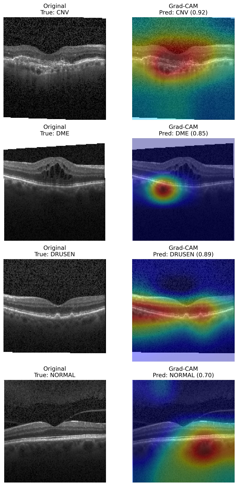

# Retinal OCT Disease Classification Using Transfer Learning

Deep learning project for classifying retinal Optical Coherence Tomography (OCT) B-scan images into four categories: **CNV, DME, DRUSEN, and NORMAL**.

This project applies transfer learning to ophthalmic image classification and includes OCT image preprocessing, class imbalance handling, model benchmarking, independent test-set evaluation, and Grad-CAM explainability.

---

## Project Preview

### Grad-CAM Explainability — EfficientNetB0

Grad-CAM was used to visualize image regions that contributed most strongly to the final EfficientNetB0 predictions.



---

## Problem Statement

Retinal OCT imaging is commonly used in ophthalmology to evaluate retinal disease patterns. The goal of this project is to build a reproducible deep learning pipeline that can classify OCT scans into disease categories and provide interpretable model outputs.

The project focuses on answering:

- Can transfer learning classify OCT images across CNV, DME, DRUSEN, and NORMAL classes?
- Which model performs better: MobileNetV2 or EfficientNetB0?
- How does the model perform beyond accuracy using macro-F1 and ROC-AUC?
- Can Grad-CAM provide visual interpretability for OCT disease predictions?

---

## Dataset

Dataset used: **Retinal OCT Images / OCT2017**  
Kaggle dataset: `paultimothymooney/kermany2018`

The dataset contains OCT images organized into four classes:

- **CNV** — Choroidal Neovascularization
- **DME** — Diabetic Macular Edema
- **DRUSEN**
- **NORMAL**

The dataset is not included in this repository due to size.

Expected local folder structure:

```text
data/
  OCT2017/
    OCT2017/
      train/
        CNV/
        DME/
        DRUSEN/
        NORMAL/
      test/
        CNV/
        DME/
        DRUSEN/
        NORMAL/
      val/
        CNV/
        DME/
        DRUSEN/
        NORMAL/
```

---

## Dataset Summary

The original training data was imbalanced across classes, with CNV and NORMAL having substantially more images than DME and DRUSEN.

| Split | CNV | DME | DRUSEN | NORMAL |
|---|---:|---:|---:|---:|
| Train | 37,205 | 11,348 | 8,616 | 26,315 |
| Validation | 8 | 8 | 8 | 8 |
| Test | 242 | 242 | 242 | 242 |

Because the original validation folder contained only 8 images per class, a validation split was created from the training folder during model development. The original balanced test set was preserved for final evaluation.

---

## Methods

The workflow included:

- OCT image loading and preprocessing
- Train/validation split creation from the training folder
- Image resizing to 160 × 160 for local training efficiency
- Data augmentation using random flipping, rotation, and zoom
- Class-weighted loss to address class imbalance
- Transfer learning with ImageNet-pretrained CNN backbones
- Model benchmarking between MobileNetV2 and EfficientNetB0
- Evaluation using accuracy, precision, recall, macro-F1, ROC-AUC, and confusion matrix
- Grad-CAM explainability for visual interpretation of model predictions

---

## Models Compared

| Model | Purpose |
|---|---|
| MobileNetV2 | Lightweight transfer learning baseline |
| EfficientNetB0 | Main model selected for final interpretation |

Both models were trained using frozen pretrained convolutional backbones and custom classification layers.

---

## Results

Both models were evaluated on the independent OCT test set containing 968 images, with 242 images per class.

| Model | Accuracy | Macro-F1 | ROC-AUC |
|---|---:|---:|---:|
| MobileNetV2 | 81.9% | 82% | 97.2% |
| EfficientNetB0 | 83.7% | 84% | 97.6% |

EfficientNetB0 achieved the best overall performance and was selected for Grad-CAM explainability analysis.

---

## Class-wise Performance

### MobileNetV2

| Class | Precision | Recall | F1-score |
|---|---:|---:|---:|
| CNV | 0.71 | 0.94 | 0.81 |
| DME | 0.79 | 0.89 | 0.84 |
| DRUSEN | 0.89 | 0.63 | 0.74 |
| NORMAL | 0.95 | 0.81 | 0.88 |

### EfficientNetB0

| Class | Precision | Recall | F1-score |
|---|---:|---:|---:|
| CNV | 0.74 | 0.94 | 0.83 |
| DME | 0.84 | 0.90 | 0.87 |
| DRUSEN | 0.85 | 0.66 | 0.74 |
| NORMAL | 0.97 | 0.85 | 0.91 |

---

## Key Findings

| # | Finding | Evidence |
|---|---|---|
| 1 | EfficientNetB0 performed best overall | 83.7% accuracy, 84% macro-F1, 97.6% ROC-AUC |
| 2 | MobileNetV2 provided a strong lightweight baseline | 81.9% accuracy, 82% macro-F1 |
| 3 | Both models performed strongly on CNV and DME recall | EfficientNetB0 recall: CNV 0.94, DME 0.90 |
| 4 | DRUSEN was the most challenging class | EfficientNetB0 DRUSEN recall: 0.66 |
| 5 | ROC-AUC remained high for both models | Both models achieved ROC-AUC above 97% |
| 6 | Grad-CAM added interpretability | Highlighted image regions contributing to EfficientNetB0 predictions |

---

## Tools and Technologies

| Tool | Purpose |
|---|---|
| Python | Model development and analysis |
| TensorFlow / Keras | Transfer learning and CNN training |
| MobileNetV2 | Lightweight CNN baseline |
| EfficientNetB0 | Main transfer learning model |
| scikit-learn | Classification reports, class weights, ROC-AUC |
| NumPy | Numerical processing |
| Matplotlib | Visualization and Grad-CAM output |
| Jupyter Notebook | Experiment development |

---

## Repository Structure

```text
retinal-oct-disease-classification/
│
├── OCT_Project.ipynb
├── README.md
├── .gitignore
│
└── outputs/
    └── efficientnet_gradcam_examples.png
```

The following folders are intentionally excluded from GitHub:

```text
data/
models/
```

The `data/` folder is excluded because the OCT dataset is large. The `models/` folder is excluded because saved model weights are large and can be regenerated by running the notebook.

---

## How to Run Locally

### 1. Clone the repository

```bash
git clone https://github.com/Chandini149/retinal-oct-disease-classification.git
cd retinal-oct-disease-classification
```

### 2. Install dependencies

```bash
pip install tensorflow scikit-learn numpy matplotlib pandas pillow jupyter
```

### 3. Download the dataset

Download the Kaggle dataset:

```text
paultimothymooney/kermany2018
```

Place the extracted dataset under:

```text
data/OCT2017/OCT2017/
```

### 4. Run the notebook

```bash
jupyter notebook
```

Open:

```text
OCT_Project.ipynb
```

and run the cells.

---

## Resume Summary

This project demonstrates an AI-based ophthalmology workflow for retinal OCT disease classification using transfer learning, class imbalance handling, independent test-set evaluation, and Grad-CAM explainability.

Best model:

```text
EfficientNetB0
Accuracy: 83.7%
Macro-F1: 84%
ROC-AUC: 97.6%
```

---

## Limitations and Future Work

This project was developed locally with limited compute, so training used controlled steps per epoch for efficiency.

Future improvements could include:

- Fine-tuning the final convolutional layers of EfficientNetB0
- Training for longer on GPU hardware
- Adding DenseNet121, ResNet50, or Vision Transformer comparisons
- Adding OCT image registration for longitudinal disease progression analysis
- Validating the model on external OCT datasets
- Saving and comparing confusion matrix images for each model

---

## Disclaimer

This project is for educational and research portfolio purposes only. It is not intended for clinical diagnosis or medical decision-making.
